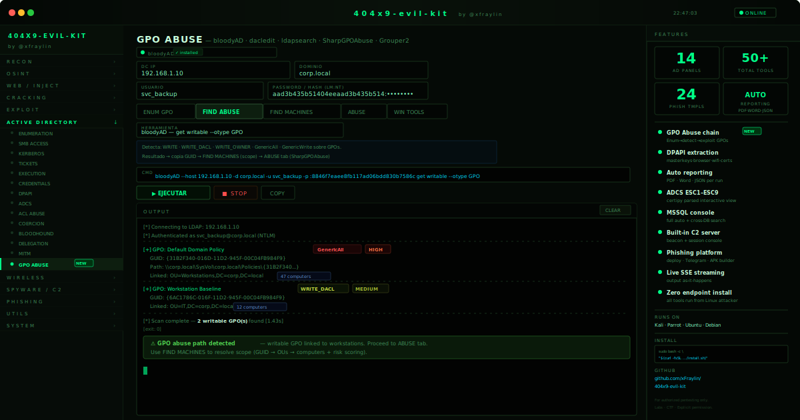

# 404x9-evil-kit

**A local web-based pentesting toolkit for Kali Linux.**  
Built by [@xFraylin](https://github.com/xFraylin)

---



---

> **Aviso legal / Disclaimer**  
> Este toolkit es únicamente para uso en entornos autorizados: laboratorios propios, CTFs, pruebas de penetración con permiso explícito del propietario del sistema.  
> **Todo uso es bajo tu exclusiva responsabilidad.** El autor no se hace responsable de ningún uso indebido, ilegal o dañino de esta herramienta.  
> Using this tool against systems you do not own or have explicit permission to test is illegal and unethical.

---

## Features

- Browser-based GUI — no extra GUI frameworks needed
- Live streaming output via Server-Sent Events (SSE)
- Smart parsed output for every tool (clean tables, no ANSI clutter)
- Scalable wordlist picker — file browser modal + custom path input
- Isolated Python venv — zero system Python pollution
- Kill switch for any running process (including sudo'd tools)

---

## Modules & Tools

### Recon
| Tool | Description |
|---|---|
| **Nmap** | Network scanner — open ports, services, OS detection, NSE vulnerability scripts. |
| **Subfinder** | Passive subdomain enumeration using public sources (DNS, APIs, certificates). |
| **Amass** | In-depth attack surface mapping — subdomains, ASNs, IPs and relationships. |
| **theHarvester** | Gathers emails, names, subdomains and IPs from public sources (Google, Bing, Shodan, etc.). |
| **WhatWeb / WAFW00F** | Web technology fingerprinting (WhatWeb) and WAF/protection detection (WAFW00F) — selectable from the same panel. |
| **WPScan** | WordPress-specific scanner — enumerates users, plugins, themes and known vulnerabilities. |

### OSINT
| Tool | Description |
|---|---|
| **Sherlock** | Searches hundreds of social networks by username to find accounts linked to a person. |
| **Holehe** | Checks if an email address is registered on popular websites without sending emails. |
| **DNSRecon** | DNS enumeration — zone transfers, brute force subdomains, SRV records, DNSSEC info. |
| **Exiftool** | Extracts metadata from files (images, PDFs, docs) — GPS, author, device, timestamps. |

### Web
| Tool | Description |
|---|---|
| **FFUF** | Highly flexible web fuzzer — supports multiple wordlist positions, filters by size/status/words. |
| **Gobuster** | Directory, file and subdomain brute force using wordlists. Fast multi-threaded scanner. |
| **Nikto** | Web server scanner that detects dangerous files, outdated software and misconfigurations. |
| **WFuzz** | Web application fuzzer focused on parameter tampering, LFI, SQLi and XSS fuzzing. |
| **DalFox** | XSS (Cross-Site Scripting) scanner with parameter analysis and PoC generation. |

### Injection
| Tool | Description |
|---|---|
| **SQLMap** | Automated SQL injection detection and exploitation — supports all major database backends. |

### Cracking
| Tool | Description |
|---|---|
| **John the Ripper** | CPU-based password cracker — supports hundreds of hash formats, wordlist + rules modes. |
| **Hashcat** | GPU-accelerated hash cracker — dictionary, brute force and hybrid attacks. |
| **HashID** | Identifies unknown hash types by analyzing format and length. |

### Brute Force
| Tool | Description |
|---|---|
| **Hydra** | Network login brute forcer — supports SSH, FTP, HTTP, RDP, SMB, and 50+ protocols. |
| **Medusa** | Parallel network login auditor — similar to Hydra, optimized for speed and modularity. |

### Exploit
| Tool | Description |
|---|---|
| **MSFVenom** | Payload generator from Metasploit — shellcode, executables and reverse shells for any platform. |
| **SearchSploit** | Offline search engine for Exploit-DB — finds public exploits without internet. |

### Active Directory
| Panel | Tools inside | Description |
|---|---|---|
| **Enumeration** | ldapdomaindump, enum4linux-ng, rpcclient, smbclient, ldapsearch | Full domain enumeration — users, groups, shares, GPOs, password policies. Parsed LDAP output with tabs: Summary / Users / Computers / OUs / Findings. |
| **SMB Access** | smbmap, crackmapexec, netexec, nxc | Share enumeration, permission mapping, credential spraying, module execution (lsassy, bloodhound, pass-pol, rid-brute, etc.). |
| **Kerberos** | kerbrute, GetUserSPNs.py, GetNPUsers.py | Username enumeration, Kerberoasting and AS-REP Roasting. |
| **Execution** | psexec.py, wmiexec.py, smbexec.py, atexec.py | Remote command execution via Impacket. |
| **Credentials** | secretsdump.py | Dumps SAM hashes, NTDS domain hashes and LSA plaintext credentials. |
| **BloodHound** | bloodhound-python, rusthound | AD data collection (users, groups, ACLs, sessions) for attack path analysis. Built-in Neo4j and BloodHound UI launchers. |
| **MITM** | responder, mitm6, ntlmrelayx.py | LLMNR/NBT-NS/DHCPv6 poisoning and NTLM relay attacks. |

### Network
| Tool | Description |
|---|---|
| **TCPDump** | Packet capture with BPF filters — inspects live traffic and saves to .pcap. |

### Wireless
| Panel | Tools inside | Description |
|---|---|---|
| **Aircrack-NG** | airmon-ng, airodump-ng, aireplay-ng, aircrack-ng | Full WPA attack suite — monitor mode → scan → capture handshake → deauth → crack. |
| **WiFi Disconnect** | airmon-ng, airodump-ng, aireplay-ng | Automated deauth workflow with live AP table — click a network, disconnect it. |

### Priv Esc
| Panel | Description |
|---|---|
| **Priv Esc** | Cheatsheet tabs — Linux (identity, SUID/SGID, cron, writable paths, shadow) / Windows (registry, services, stored credentials) / GTFOBins (sudo + SUID one-liners) / TTY Upgrade (Python pty, stty). |
| **Rev Shells** | Reverse shell one-liners with tabs — Bash, Python, Netcat, PHP/Perl, Windows/PowerShell, Listeners. Quick netcat listener launcher included. |
| **LINPEAS / WINPEAS** | Download and run commands for PEASS-ng scripts (linpeas, winpeas) + built-in HTTP server to serve them to targets. |

### Utils
| Tool | Description |
|---|---|
| **cURL** | Advanced HTTP client — custom headers, methods, body, auth, proxy and cookie support. |
| **Wget** | Recursive file downloader — mirror sites, download files from targets. |
| **HTTPX** | Fast HTTP toolkit — probes URLs for status, title, tech stack, CDNs and redirect chains. |
| **Encoder** | Client-side encode/decode and transform chain — URL, HTML entities, Base64, Hex, Unicode escape, JSON escape, ROT13, MD5, SHA1, SHA256. Transformations chain sequentially. |

### System
| Panel | Description |
|---|---|
| **Herramientas** | Checks which tools are installed on your Kali — visual status grid with one-click install shortcuts. |
| **Archivos** | File browser for `/tmp` and `/root` — lists files in the active working directories. |
| **Historial** | Session command history — all commands run in the current session, with a clear option. |

---

## Instalación rápida (una sola línea)

```bash
sudo bash -c "$(curl -fsSL https://raw.githubusercontent.com/xFraylin/404x9-evil-kit/main/install.sh)"
```

El script clona el repo, instala las herramientas necesarias, crea el venv e instala todas las dependencias Python adentro.

---

## Requirements

- Kali Linux (or any Debian-based distro)
- Python 3.10+
- Root access for installation

---

## Installation (manual)

```bash
git clone https://github.com/xFraylin/404x9-evil-kit.git
cd 404x9-evil-kit
sudo bash install.sh
```

The installer will:
1. Clone the repo automatically if run via `curl`
2. Install system binaries via `apt` (skips already installed tools)
3. Copy all files to `/opt/x9-evilkit/`
4. Create an isolated venv at `/opt/x9-evilkit/venv/`
5. Activate the venv and install all Python dependencies from `requirements.txt`
6. Create the `/usr/local/bin/404x9-evil-kit` launcher
7. Create a desktop shortcut

---

## Usage

```bash
404x9-evil-kit
```

The launcher activates the venv automatically and opens `http://localhost:5000` in your browser.

### Manual start

```bash
# 1. Activate the venv
source /opt/x9-evilkit/venv/bin/activate

# 2. Run the server
cd /opt/x9-evilkit
python3 server.py
```

### Virtual environment reference

```bash
# Activate
source /opt/x9-evilkit/venv/bin/activate

# Verify it's active (should show venv path)
which python
# → /opt/x9-evilkit/venv/bin/python

# Deactivate when done
deactivate
```

> **Note:** `source /opt/x9-evilkit/venv` is **wrong** and does nothing.  
> Always use `source /opt/x9-evilkit/venv/bin/activate`.

---

## Project Structure

```
404x9-evil-kit/
├── server.py           # Flask backend — SSE streaming, process manager
├── requirements.txt    # Python dependencies (installed inside venv)
├── install.sh          # Installer — one-liner compatible
├── run.sh              # Quick launcher (activates venv + starts server)
├── templates/
│   └── index.html      # Full single-page frontend
└── static/
    └── favicon.ico     # Skull favicon
```

---

## How It Works

1. **Frontend** (`index.html`) sends commands to the Flask backend via POST to `/api/run`
2. **Backend** spawns the process and streams output line-by-line via `/api/stream/<job_id>` (SSE)
3. **Frontend** buffers all output and runs tool-specific parsers on completion to render clean tables
4. **Kill** — `/api/kill/<job_id>` sends SIGTERM + SIGKILL to the entire process group (handles sudo'd tools)

---

## License

MIT — do whatever you want with it.
